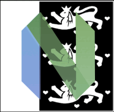

# Den Danske Ordbog inside Neovim

UI for [curl](https://curl.se/) calls to [DDO](https://ordnet.dk/ddo)



I contacted Det Danske Sprog- og Litteraturselskab asking if they had an API. They never responded so I wrote a script called `,slåop`. This is a fancy ish port of that. I never intended doing this. But by popular demand from [Mads](https://github.com/madskjeldgaard/)  here we are.

WIP. Feel free to contribute, though the code is kinda ugly 😏

## Dependencies

`curl` `htmlq` `ripgrep` `sed`

## Installation

#### Lazy
```lua
{
    "salkin-mada/ddo.nvim",
    config = function()
        vim.g.ddo_default_mappings = true
        vim.g.ddo_always_load = true
        require('ddo').setup()
    end
},
```

#### Packer
```lua
use {
    'salkin-mada/ddo.nvim',
    config = function()
        vim.g.ddo_default_mappings = true
        vim.g.ddo_always_load = true
        require('ddo').setup()
    end
}
```

## Provided by the maintainer(s)

#### Settings:

`vim.g.ddo_always_load` (default: false) \
`vim.g.ddo_default_mappings` (default: false) \
`vim.g.ddo_window_blend` (default: `0`%)

#### Global keymaps:

open query prompt with `<leader>å` (`vim.g.ddo_toggle`) \
toggle result with`<leader>ø` (`vim.g.ddo_reader_toggle`)

#### Commands:

`:DDO` and `:DDORead` \
(`:DDOLoad` only available when `vim.g.ddo_always_load` is false)

#### Buffer keymaps:

send query with `<Enter>` \
close ddo with `<Esc>` (in insert- and normal mode) or `q` (in normal mode)

## TODO

* housekeeping/clean up...
* add __ods__, __korpusdk__ and __moths ordbog__ to the "`query sink`" (should be selectable somehow. Maybe via FzfLua or a snazzy togglable mouse/mapping button array)
* move `ddo.sh` into Lua code (totally possible, but pain in the *ss to do `htmlq`)
* figure out how to "expand" all the f*#¤! `...vis mindre`, `...vis mere` etc..
